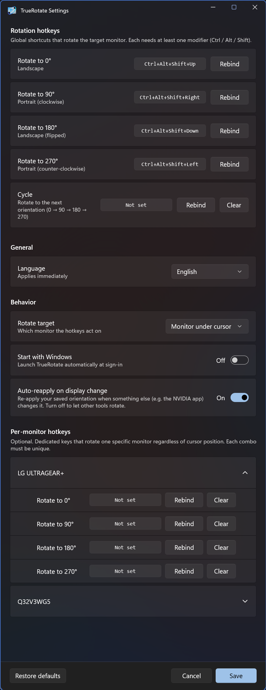

# TrueRotate

[](https://github.com/BK927/true-rotate/releases)
[](https://github.com/BK927/true-rotate/releases)
[](LICENSE)


**A modern Windows display-rotation tray app that fixes the NVIDIA mouse-axis bug.**

**[⬇ Download the latest release](https://github.com/BK927/true-rotate/releases)** — a modern, open-source replacement for the old **iRotate**.

<p align="center">
  
</p>

TrueRotate lives in your system tray and rotates any monitor (0° / 90° / 180° / 270°) from a
global hotkey or the tray menu. It's a modern replacement for the old *iRotate* utility, built
to solve the one problem iRotate never could:

> After the NVIDIA app touches *any* display setting, rotating a display leaves the **mouse
> moving along the wrong axis**, with parts of the screen the cursor can't reach ("dead
> zones"). The breakage is semi-permanent — it survives reboots.

TrueRotate neutralizes this on every rotation. See [How the fix works](#how-the-fix-works).

## Features

- **Global hotkeys** — `Ctrl`+`Alt`+`Shift`+`Arrow` → 0/90/180/270° by default; fully rebindable.
- **Tray menu** — rotate any monitor directly via per-monitor submenus.
- **Per-monitor memory** — remembers each monitor's orientation (keyed by a stable device id)
  and restores it.
- **Auto-reapply** — when something resets a monitor's orientation (e.g. the NVIDIA app),
  TrueRotate restores your chosen orientation automatically, through the cured path. See
  [Rotate with TrueRotate, not other tools](#-rotate-with-truerotate-not-other-tools).
- **Rotate target** — hotkeys act on the monitor under the cursor, the primary monitor, or all
  monitors (your choice).
- **Start with Windows** — optional autostart.
- **No admin required.**

## Install & run

Requirements: Windows 10/11. (Developed and verified on an NVIDIA GPU; works on any GPU.)

**Easiest — prebuilt:** download the latest [release](https://github.com/BK927/true-rotate/releases), extract the zip anywhere, and run `TrueRotate.exe`. No installer, no admin, no .NET runtime needed (self-contained).

Or build from source — needs the [.NET 10 SDK](https://dotnet.microsoft.com/download):

```sh
dotnet build -c Release
# → bin/Release/net10.0-windows/TrueRotate.exe
```

Or produce a standalone exe that needs no installed runtime:

```sh
dotnet publish -c Release -r win-x64 --self-contained
```

Run `TrueRotate.exe`. It starts in the system tray — check the hidden-icons **^** overflow and
drag it out to keep it visible.

## Usage

### Hotkeys (default)

| Hotkey | Rotation |
| --- | --- |
| `Ctrl`+`Alt`+`Shift`+`↑` | 0° (landscape) |
| `Ctrl`+`Alt`+`Shift`+`→` | 90° |
| `Ctrl`+`Alt`+`Shift`+`↓` | 180° |
| `Ctrl`+`Alt`+`Shift`+`←` | 270° |

By default a hotkey rotates the monitor **under your cursor**.

### Tray menu

Right-click the tray icon: per-monitor rotation, **Settings…**, **Auto-reapply** toggle, and
**Exit**.

### Settings

Open **Settings…** from the tray to:

- Rebind each rotation hotkey (click **Rebind**, then press the combo).
- Choose the rotate target: **cursor monitor / primary / all monitors**.
- Toggle **Start with Windows**.
- Toggle **Auto-reapply on display change**.

Settings are stored in `%AppData%\TrueRotate\config.json`.

## ⚠️ Rotate with TrueRotate, not other tools

TrueRotate **enforces** the orientation you set in it. If you rotate a monitor through the
**NVIDIA app or Windows Settings**, TrueRotate reverts it to the orientation you last set in
TrueRotate.

This is deliberate. Other tools rotate *without* applying TrueRotate's cursor cure, so they would
bring the mouse-axis bug back. By reverting and re-applying through its own cured path, TrueRotate
keeps the cursor correct.

**So change orientation from TrueRotate (hotkey or tray menu), not from external tools.** If you
really need an external tool to change orientation, turn **Auto-reapply** off first (tray menu
or Settings).

## How the fix works

On an affected machine, a plain rotation updates the displayed image and every Windows
orientation value (CCD, GDI bounds, and legacy DEVMODE all agree) — but the **mouse cursor's
coordinate transform is not rebuilt**, so the cursor stays mapped to the old orientation (wrong
axis + dead zones).

TrueRotate rotates via the CCD API with the **`SDC_FORCE_MODE_ENUMERATION`** flag, which forces a
mode re-enumeration and rebuilds the cursor transform on every rotation — neutralizing the bug
rather than trying to remove it. (Legacy `ChangeDisplaySettingsEx` is blocked by the driver, so
CCD is the only working route.)

Full technical write-up: [DESIGN.md](DESIGN.md).

## CLI

The same executable doubles as a CLI for verification/recovery (output appears in the launching
terminal):

```sh
TrueRotate.exe list                        # list monitors + current rotation
TrueRotate.exe set <index> <0|90|180|270>  # rotate a monitor
TrueRotate.exe test <index>                # round-trip rotation self-test
```

## Limitations

- The **Win** key can't be used as a hotkey modifier (a WinForms key-capture limitation).
- Developed and verified on an NVIDIA RTX 5060 Ti, dual-monitor setup.

## License

[MIT](LICENSE) © 2026 BK927

---

<sub>Keywords: Windows screen rotation · rotate display with a hotkey · NVIDIA rotation mouse wrong-axis / wrong-direction fix · dead-zone after rotating · portrait monitor · multi-monitor rotation · system-tray display rotator · iRotate alternative for Windows 10/11 · WinUI 3 utility.</sub>
